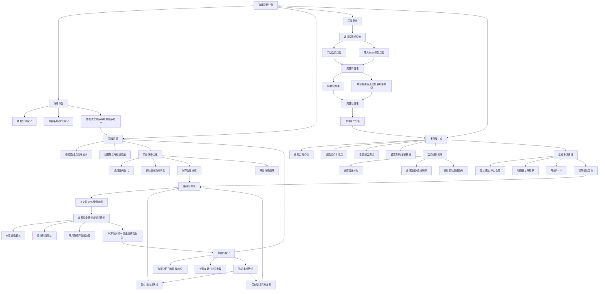
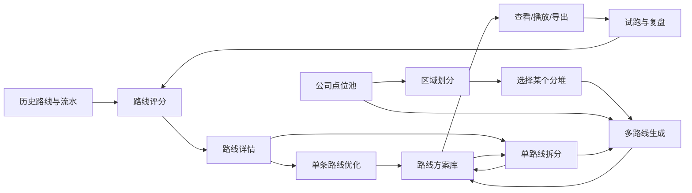

# 路线规划项目功能说明图

## 一、总体业务流程

## 二、功能之间的关系

### 1. 路线评分是分析入口

路线评分主要回答“现有路线执行得怎么样”：

- 可以按公司查看整体评分。
- 可以下钻到具体路线或岗位。
- 可以结合流水顺序与规划顺序进行对比。
- 支持最长顺序重合、命中率、准确率和召回率等分析。
- 评分结果可以继续进入路线详情，查看具体点位和路线。

它主要用于发现问题和评估效果，本身不直接生成新路线。

### 2. 路线详情是单路线优化入口

路线详情面向一条已有路线或岗位：

- 查看路线点位、流水记录和规划信息。
- 查看路线地图、点位顺序和轨迹播放。
- 使用直线距离或实际道路距离进行单条路线优化。
- 保存优化后的单条路线。
- 也可以把这条路线送入“单路线拆分”。

单条路线优化不改变点位数量，主要改变点位顺序。

### 3. 单路线拆分是从一条路线生成多趟路线

单路线拆分解决的是：

> 一条原本作为岗位或路线管理的长路线，如何拆成多趟实际收运路线。

来源有两种：

- 公司已有的路线/岗位。
- 路线方案库中已经保存的某一趟路线。

拆分时可以设置：

- 车辆额定载重和最大载重。
- 目标装载率。
- 最大趟数。
- 起点、终点和候选终点。
- 直线分组、道路精排或全程道路距离策略。

生成后可以保存当前路线，也可以保存整组拆分方案。

### 4. 区域划分是多路线生成前的点位准备

区域划分并不直接生成路线，它负责把公司点位池整理成若干个点位分堆。

输入来源包括：

- 公司点位池手动选择。
- Excel 导入并按名称匹配。
- 多个 Excel sheet 形成多个聚类前分堆。

处理结果包括：

- 聚类前分堆。
- 聚类后分堆。
- 分堆统计。
- 地图颜色展示。
- 分堆结果导出。
- 将某一个分堆直接送入多路线生成。

因此，区域划分和多路线生成是“前置整理”和“路线规划”的关系。

### 5. 多路线生成是公司点位池的整体排线入口

多路线生成面向一批待收运点位：

- 可以是整家公司选中的点位。
- 也可以是区域划分后选中的某一个分堆。
- 可以配置车辆数量、车型、额定载重、最大载重和趟数。
- 支持车辆顺序排班、轮询排班和默认排班。
- 支持起点、终点、候选终点。
- 支持直线快速分组、直线分组后道路精排、全程实际道路距离。
- 支持进度展示、停止任务、路线地图、轨迹播放和 Excel 导出。
- 生成结果可以作为整组方案保存。

### 6. 路线方案库是所有优化结果的统一出口

以下结果都可以进入方案库：

- 单条路线优化结果。
- 单路线拆分后的单趟路线。
- 单路线拆分后的整组方案。
- 多路线生成后的整组方案。
- 导入的外部路线。

方案库支持：

- 方案分组和文件夹管理。
- 查看整组路线或单条路线。
- 切换点位直线和道路折线。
- 地图展示和路线播放。
- 导入外部路线并匹配公司点位。
- 从某一趟保存路线再次进入路线拆分。

## 三、项目闭环

这套系统的核心闭环是：

> 先看现状和评分，再查看原路线；可以优化单条路线，也可以拆分和生成多条路线；所有结果进入方案库，最后用于地图查看、导出、司机试跑和后续复盘。
